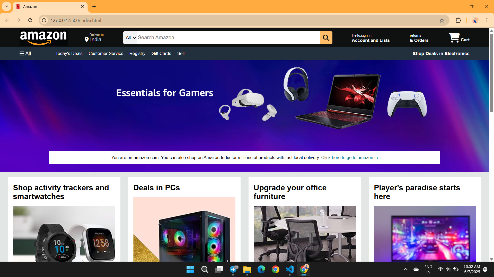
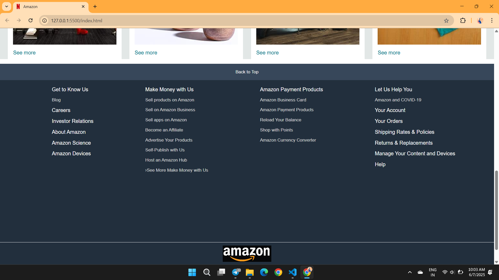

# Amazon_Clone_Website_Project_using_HTML_CSS
A static Amazon clone website built using HTML5 and CSS3. This project replicates Amazon's homepage layout for practice with responsive design, Flexbox, and Grid. No JavaScript or backend—just front-end UI for learning and design exploration.

## 🚀 Features

- Fully static homepage clone
- Responsive layout using CSS Flexbox & Grid
- Amazon-style navigation bar and hero section
- Multiple product sections with images
- No JavaScript or backend logic

## 📁 Project Structure

- `index.html` – Main HTML structure
- `style.css` – All styles for layout and design

## 🛠️ Tools Used

- HTML5
- CSS3 (Flexbox, Grid)
- Visual Studio Code

  ## 📽️ Demo Video

[🎬 Click here to watch the demo video](./demoRec.mp4)

## 📸 Screenshots

### 🏠 Homepage (Landing Page)

### 📄 Scroll View 1

### 📄 Scroll View 2

  
